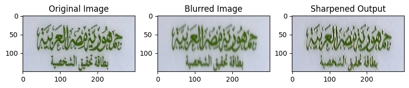

# Image Enhancement Task

This Jupyter Notebook contains code for an image enhancement task using a U-Net model for sharpening blurred images.

## Table of Contents

- [Introduction](#introduction)
- [Prerequisites](#prerequisites)
- [Installation](#installation)
- [Usage](#usage)
- [Results](#results)
- [Conclusion](#conclusion)

## Introduction

The code in this notebook addresses an image enhancement task, specifically sharpening blurred images using a U-Net model. The notebook includes steps for importing necessary libraries, loading and preprocessing images, building and training the U-Net model, and evaluating the results.

## Prerequisites

Before running the code, ensure you have the following libraries installed:

- NumPy
- Pandas
- Pillow (PIL)
- Matplotlib
- TensorFlow

You can install these libraries using the following:

```bash
pip install numpy pandas Pillow matplotlib tensorflow
```

## Installation

 - Clone the repository:
```bash
git clone https://github.com/Mu-Magdy/Data-Science.git/

cd Blnk Task
```

-  Open the Jupyter Notebook:
bash

```
jupyter notebook Blnk_image_inhancement_task.ipynb
```

## Usage
Follow the instructions in the Jupyter Notebook to execute the code. The notebook includes sections for importing libraries, setting global variables, unzipping image files, loading images, preprocessing, building the U-Net model, training, and evaluating the model.

## Results
The notebook includes visualizations of original, blurred, and sharpened images. Additionally, it discusses the limitations of the U-Net model for image enhancement and suggests further steps for improvement, such as exploring different architectures or using Generative Adversarial Networks (GANs).



## Conclusion
In conclusion, the U-Net model serves as a starting point for image enhancement, and the notebook highlights the potential for improvement in the chosen task. The field of image enhancement is vast, and further exploration could lead to more advanced and effective models.